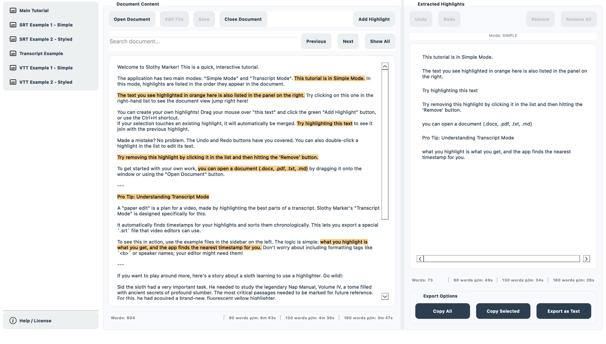

# Slothy Marker

<div align="center">
  
</div>
<br/>
<p align="center">
  <strong>Your friendly assistant for summarizing documents. Quickly extract, review, and manage highlighted text to turn hours of review into minutes of focused work.</strong>
</p>
<p align="center">
  
  
</p>

Part of my ongoing EmTools project where I utilise AI to develop applications.

---

<p align="center">
  
</p>

## 🌟 Core Features

*   **✍️ Instant Extraction:** Automatically finds and lists all pre-highlighted text from your documents.
*   **✂️ Full Editing Suite:** Add, remove, merge, and edit highlights. Reorder and categorize them to structure your ideas.
*   **🔍 Powerful Search:** Instantly find any term in your document and highlight all occurrences in a single click.
*   **🎬 Transcript Mode:** A special mode for video editors to create "paper edits" from transcripts, with automatic timestamp detection and chronological sorting.
*   **📊 Live Stats:** Get at-a-glance statistics for your document and highlights, including word counts, reading times, and total duration.
*   **↩️ Undo/Redo:** A complete history stack lets you undo and redo any action, so you can work without fear.
*   **🔄 External Editor Integration:** Open your work in your favorite text editor, and Slothy Marker will automatically reload your changes.

## 📂 Supported File Formats
You can open and process the following file types:
*   `.docx`
*   `.pdf`
*   `.txt`
*   `.md`

## 🚀 Installation

You can either download a pre-built version of the application or run it directly from the source code.

### For Users (Recommended)

Pre-compiled versions for your operating system can be found on the **[Releases](https://github.com/user/repo/releases)** page of this repository. This is the easiest way to get started.

### For Developers (Running from Source)

If you want to run the application from its source code, you'll need Python 3.

**1. Clone the repository:**
```bash
git clone https://github.com/emzakit/slothymarker.git
cd slothymarker
```

**2. Create and activate a virtual environment (recommended):**
```bash
# For Windows
python -m venv venv
.\venv\Scripts\activate

# For macOS/Linux
python3 -m venv venv
source venv/bin/activate```

**3. Install the required dependencies:**
```bash
pip install -r requirements.txt
```

**4. Run the application:**
```bash
python main.py
```
*(Note: You may need to replace `main.py` with the actual name of the main script if it differs).*

### 📦 Building the Application

Convenience scripts are provided to bundle the application into a distributable executable (`.exe` for Windows, `.app` for macOS) using PyInstaller.

These scripts automatically include necessary assets by reading from `collect_files.txt` and `collect_folders.txt`. Make sure these files are populated with any new assets you add.

*You must build in the desired operating system or virtual machine.*

*   **On Windows:**
    Run the Windows build script to create a `.exe` file in the `dist` folder.
    ```bash
    python build_win.py
    ```

*   **On macOS:**
    Run the macOS build script to create a `.app` bundle in the `dist` folder.
    ```bash
    python build_mac.py
    ```

---

## 📖 How to Use

### ▶️ Getting Started
To begin, simply drag a supported file (`.docx`, `.pdf`, `.txt`, `.md`) anywhere onto the application window, or use the **Open Document** button.

### ✍️ Basic Editing

*   **Adding a New Highlight:**
    1.  In the left document viewer, use your mouse to select any piece of text.
    2.  Click the green **Add Highlight** button or press `Ctrl+H`.
    3.  If your new selection touches an existing highlight, it will be automatically merged.

*   **Removing a Highlight:**
    1.  In the right highlights panel, click on the highlight you wish to remove.
    2.  Click the red **Remove** button at the top of the right panel.

### 🛠️ Advanced Editing

*   **In-Place Editing:** To fix a typo or change the text of a highlight, simply **double-click** on it in the list. The text will become editable. Press `Enter` to confirm.

*   **Categorizing Highlights:** Assign colors to categorize your highlights. **Right-click** on any highlight in the list and choose a category from the "Assign Category" menu.

*   **Manual Reordering:** When not in Transcript Mode, you can change the order of your highlights to structure your narrative. Simply **click and drag** a highlight in the list to a new position.

### ✨ Power Features

*   **Search & Highlight All:** Use the search bar in the document panel to find text. In addition to "Previous" and "Next", you can click **Highlight All** to instantly turn every occurrence of your search term into a new highlight.

*   **External Editing & Live Reload:**
    1.  Click the **Edit File** button. This saves a new version of your document with highlights encoded using `==...==` syntax.
    2.  This new file will open in your default text editor.
    3.  Make any changes you want—even add new highlights using the `==...==` syntax!
    4.  When you save the file in your editor, Slothy Marker will **automatically detect the changes and reload the document**.

### 🎬 Transcript Mode (for Paper Edits)

This mode is designed for video editors creating a "paper edit" from a transcript.

*   **Activation:** To activate this mode, the file you open **must begin with one of the following tags on the very first line**: `[SRT]`, `[VTT]`, or `[TRANSCRIPT]`.
*   **Features:**
    *   Highlights are automatically sorted chronologically by the nearest preceding timestamp.
    *   The statistics panel displays the total duration of your highlighted sections, perfect for timing an edit.
    *   You can include formatting tags like `<b>...</b>` or speaker names for use in your editing software.

### 📊 The Statistics Panel
Live data appears at the bottom of the document and highlight panels.

*   **Document Panel:** Shows the total word count and estimated reading time for the entire document. In Transcript Mode, it shows the total duration of the source file.
*   **Highlights Panel:** Shows the combined word count and reading time of all your highlights. In Transcript Mode, it shows the total duration of just the highlighted sections.

## 🤖 The Emzakit Project
This application is part of my ongoing **Emzakit** project, where I explore and utilise AI to develop useful applications.

**AI tools used in this project:**
*   Google AI Studio
*   ChatGPT 4o

## 📄 License

This project is licensed under the MIT License. A copy of the license text is included in the application's help documentation.

<hr>
<p align="center">Created with ❤️ by Mundhir Werner</p>

